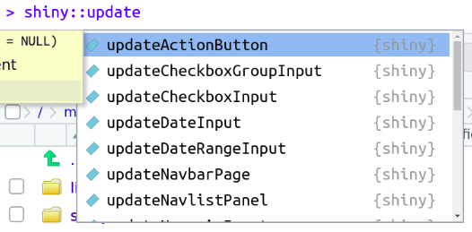
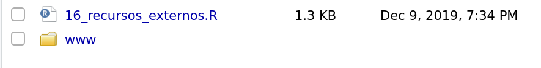

```{r setup, include=FALSE}
library(knitr)
library(shiny)
library(tidyverse)
options(htmltools.dir.version = FALSE)
```

class: middle

## Tópicos extras:

### 1. debug com `print(input$*)` e `browser()`

### 2. UIs dinâmicos

### 3. Recursos externos (CSS, imagem, etc)


---

class: middle, center, inverse

# Debug

---

## Debug

Debugar é o ato de rastrear a causa dos erros.

--

### Observando os valores dentro do `input`

```{r, eval=FALSE}
ui <- fluidPage(
  sliderInput("num1", "n1:", 1, 100, 20),
  sliderInput("num2", "n2:", 1, 100, 50),
)
server <- function(input, output) {
  observe({
    print(input)
    print(as.list(input))
    cat("classe do input: ", class(input))
  })
}
shinyApp(ui, server)
```


---

## Debug

Debugar é o ato de rastrear a causa dos erros.

### Entrando dentro do programa via `browser()`

```{r, eval=FALSE}
# ...exemplo do hello world...

output$hist <- renderPlot({
  
  browser() # << função vai dentro de onde você deseja debugar
  
  hist(dados(), main = input$title)
})
```

Exercício: aplique esse código no código do `hello world`.


---

class: middle, center, inverse

# UIs dinâmicos


---

## UIs dinâmicos

### update inputs 

Funções da família **`update*`**



Exercício1: ver exemplo `13_update_ui.R`
Exercício2: ver exemplo `14_territory_example.R`

---

## UIs dinâmicos

### **`uiOutput()`** e **`renderUI()`**

A função **`uiOutput()`** permite que o os componentes do aplicativo sejam gerados dentro do server, gerados dentro de um **`renderUI()`**.

Exercício1: ver exemplo `15_uioutput_renderui.R`

---

class: middle, center, inverse

# Recursos externos

---

## Recursos externos

Recursos externos podem ser CSS, imagens, JavaScript ou qualquer outro recurso utilizado direto do seu computador (ou da nuvem também).

### Pasta `www`



Será onde o shiny irá procurar pelos arquivos. O nome `www` é **obrigatório**.

---

## Recursos externos

Recursos externos podem ser CSS, imagens, JavaScript ou qualquer outro recurso utilizado direto do seu computador (ou da nuvem também).

### Exemplo: imagem

```{r, eval = FALSE}
img(src = "curso_r_logo.png", height = 30)
```


### Exemplo: CSS

```{r, eval = FALSE}
tags$head(
      tags$link(rel = "stylesheet", type = "text/css", href = "custom.css") 
    )
```

Exercício: ver exemplo `16_recursos_externos.R`.

---

## Referência

Esse curso usou exemplos do livro [Mastering Shiny do Hadley Wickham](https://mastering-shiny.org/action-dynamic.html#updating-inputs).
