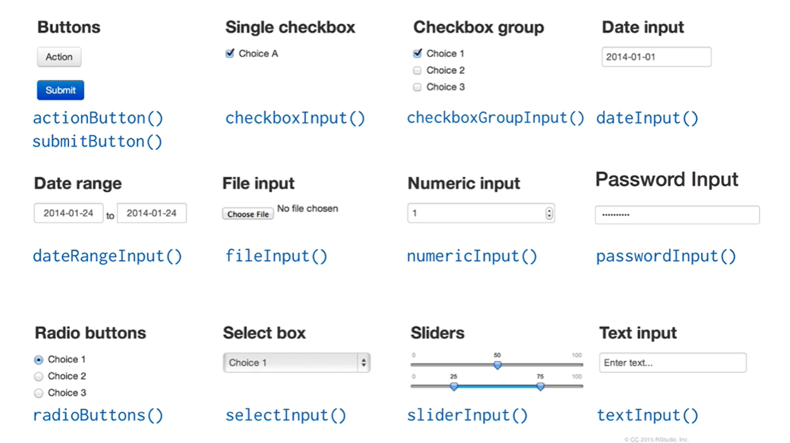
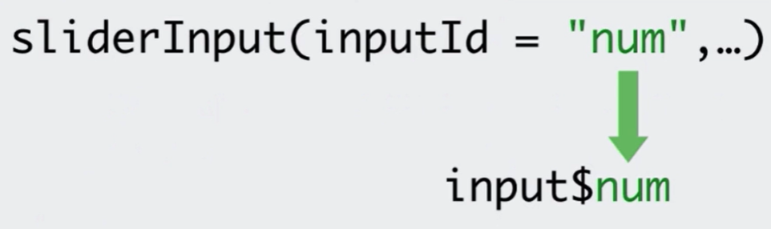
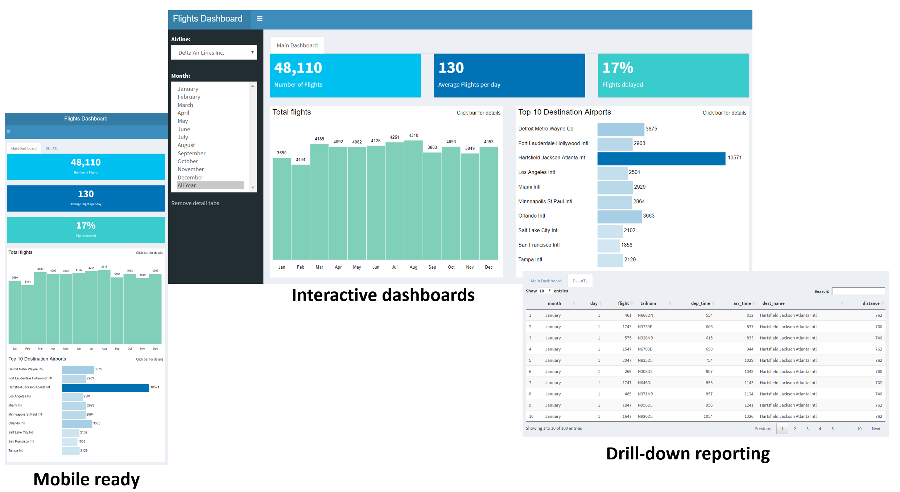
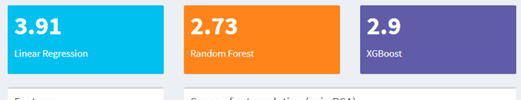
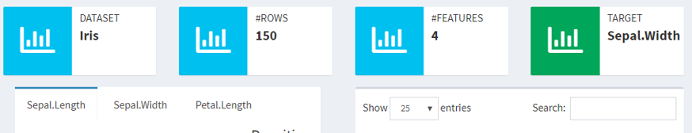
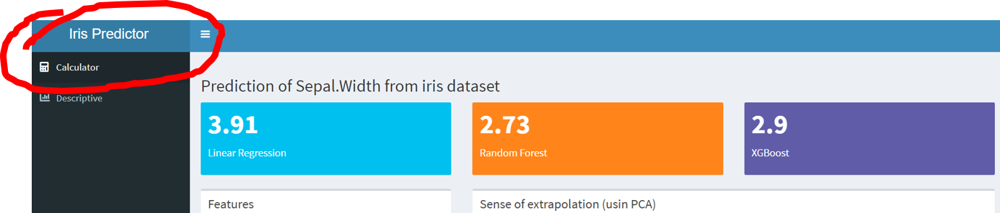

```{r setup, include=FALSE}
library(knitr)
library(shiny)
library(tidyverse)
options(htmltools.dir.version = FALSE)
```

class: middle

## Iremos aprender...

### 1. O básico de um Shiny App

### 2. Reatividade

### 3. Layouts (shinydashboard)


---
class: middle

## Dashboards Dinâmicos


.footnote[
source: [rstudio.com/shiny/](http://www.rstudio.com/shiny/)
]

---
class: middle, center


### Motivação:

### [Shiny Gallery](https://shiny.rstudio.com/gallery/)

### [Show me Shiny Website](https://www.showmeshiny.com/)

---

## Hello World

```{r, echo=TRUE, eval=FALSE}
library(shiny)

ui <- fluidPage("Hello World!")

server <- function(input, output, session) {
  
}

shinyApp(ui, server)
```

---
class: middle, center

## Ao R!


---

## Inputs e Outputs


```{r, echo = TRUE, eval = FALSE}
ui <- fluidPage(
  # *Input() functions,
  # *Output() functions
)
```

---

## Inputs 



.footnote[
source: [rstudio.com/shiny/](http://www.rstudio.com/shiny/)
]


---

## Outputs

```{r, echo = FALSE, eval=TRUE}
tibble::tribble(~Function, ~Output,
                "imageOutput()", "image",
                "plotOutput()", "plot",
                "tableOutput()", "table",
                "textOutput()", "text",
                "verbatimOutput()", "text",
                "htmlOutput()", "raw HTML",
                "dataTableOutput()", "interactive table",
                "uiOutput()", "a Shiny UI element") %>% knitr::kable(format = "html")
```


---

## No exemplo "hello world" vamos...

1) inserir um sliderInput que aceita valures de 1 a 100.

2) inserir um plotOutput()

3) inserir um textInput com `inputId = "title"`. (exercício!)

---

## Server


```{r, echo = TRUE, eval = FALSE}

server <- function(input, output, session) {
  
  
  
  
  
  
}
```

---

## Server

```{r, echo = TRUE, eval = FALSE}

server <- function(input, output, session) {
  
  output$hist <- renderPlot({
    hist(rnorm(100))    
  })
  
}
```

--

Lembrando do nosso UI...

```{r, echo = TRUE, eval = FALSE}
ui <- fluidPage(
  
  ...
  
  plotOutput("hist")
)

```


---

## Server

### funções **`render*()`**

.pull-left[

```{r, echo = FALSE, eval=TRUE}
tibble::tribble(~`*output()`, ~`render*()`,
                "imageOutput()", "renderImage()",
                "plotOutput()", "renderPlot()",
                "tableOutput()", "renderTable()",
                "textOutput()", "renderText()",
                "verbatimOutput()", "renderText()",
                "htmlOutput()", "renderUI()",
                "dataTableOutput()", "renderDataTable()",
                "uiOutput()", "renderUI()") %>% knitr::kable(format = "html")
```


]

.pull-right[

```{r, echo = TRUE, eval = FALSE}
# ui
plotOutput("hist")
```

```{r, echo = TRUE, eval = FALSE}
# server
output$hist <- renderPlot({
  hist(rnorm(100))    
})
```


]


---

## Valores Reativos e Funções Reativas

Use valores dos inputs com **`input$`**

.pull-left[


]

.pull-right[



- `render*()` são **funções reativas**

- `input$*` são **valores reativos**

]

.footnote[
source: [rstudio.com/shiny/](http://www.rstudio.com/shiny/)
]

--

se colocarmos **`input$num`** dentro do **`renderPlot()`** no nosso exemplo, o output irá reagir caso o usuário mexa no slider.

```{r, echo = TRUE, eval = FALSE}
# server
hist(rnorm(input$num))
```


---

## Server

### Recapitulando:

Dentro da função `server`,

1) salve o output usando **`output$hist <- render*()`**

2) alimente o output **`render*()`** com código

3) acesse os valores dos inputs com  **`input$*`**

4) crie reatividade usando **`input$*`** dentro dos **`render*()`**

```{r, echo = TRUE, eval = FALSE}
# server
output$hist <- renderPlot({
  hist(rnorm(input$num))    
})
```

---

## Voltando ao nosso exemplo "hello world"...

1) faça o título do histograma depender do textInput que você criou anteriormente. (exercício!)

2) finalmente, crie um **`verbatimTextOutput("summary")`** no ui e o alimente com  **`summary(rnorm(input$num))`** usando **`renderPrint({})`** no server. (exercício!)

---

class: middle, center, inverse

# Reatividade

---

## Reatividade

Reatividade é a relação entre **valores reativos** e **funções reativas**: **valores reativos** disparam **funções reativas**


---

## Contexto de Reatividade

Valores reativos só podem ser usados dentro de **contextos de reatividade**.

### Certo

```{r, echo=TRUE, eval= FALSE}
# server
* output$hist <- renderPlot({hist(rnorm(input$num))})
```

### Errado

```{r, echo = TRUE, eval=FALSE}
# server
output$hist <- hist(rnorm(input$num))
```


---

## Funções Reativas

### Principais funções reativas no Shiny

- **`render*({})`**

- **`reactive({})`**

- **`isolate({})`**

- **`observe({})`**

- **`eventReactive({})`**

- **`oberveEvent({})`**

---

## Funções Reativas

### **`reactive({})`**

Constrói uma **expressão reativa** (se comportam como **`input$*`**!).

```{r, echo = TRUE, eval=FALSE}
# server
data <- reactive({
  rnorm(input$num)
})
```

É usado como uma função qualquer do R:

```{r, echo = TRUE, eval=FALSE}
# server
output$summary <- renderPrint({
  summary(data())
})
```

---

## Funções Reativas

### **`reactive({})`**


1) Exercício: crie uma expressão reativa data() no exemplo 'hello world'.

.footnote[
source: [rstudio.com/shiny/](http://www.rstudio.com/shiny/)
]


---

## Funções Reativas

### **`isolate({})`**

Transforma um **valor reativo** em um **valor não reativo**.

```{r, echo = TRUE, eval=FALSE}
# server
output$hist <- renderPlot({
  title <- isolate(input$title)
  hist(data(), main = title)
})
```

Agora o **`renderPlot({})`** NÃO vai reagir se o **`input$title`** mudar.


---

## Funções Reativas

### **`observeEvent({})`**

Útil para disparar um bloco de código assim que um certo **`input$*`** mudar.

```{r, echo = TRUE, eval=FALSE}
# ui
actionButton("write_data", "Write Data as CSV")
```

```{r, echo = TRUE, eval=FALSE}
# server
observeEvent(input$write_data, {
  write.csv(data(), "data.csv")
})
```

PS: actionButton é apenas outro tipo de input! Útil para ser usado com **`observeEvent()`**. Ver [Using Action Button](https://shiny.rstudio.com/articles/action-buttons.html) do Shiny docs.

Exercício: coloque a funcionalidade 'write data' no exemplo 'hello world'.

---

## Funções Reativas

### **`observe({})`**

Também útil para disparar um bloco de código no servidor, porém qualquer **expressão/valor reativo** dentro dele vai dispará-lo.

```{r, echo = TRUE, eval=FALSE}
# server
observe({
  print(data())
  print(as.numeric(input$writ_data))
})
```


---

## Funções Reativas

### **`eventReactive({})`**


Cria uma **expressão reativa** que responde às mudanças do **`input$*`** dentro dele (ou de qualquer outra **expressão reativa**).

```{r, echo = TRUE, eval=FALSE}
# ui
actionButton("update", "Update!")
```

```{r, echo = TRUE, eval=FALSE}
# server
data <- eventReactive(input$update, {
  write.csv(data(), "data.csv")
})
```

Exercício: atualize o **`data()`** para um eventReactive no 'hello world'.


---

class: middle, center, inverse

# Layouts

## [shiny.rstudio.com/layout-guide](https://shiny.rstudio.com/articles/layout-guide.html)

---

## Mas antes... HTML Tags

```{r, echo = TRUE, eval = FALSE}
fluidPage(
  tags$h1("Meu Primeiro Shiny App"),
  tags$p(
    "O link para o site do Shiny é ",
    tags$a(href = "https://www.rstudio.com/shiny/", "rstudio.com/shiny."),
    tags$strong("Recomendo fortemente que você dê uma olhada!")
  )
)
```

```{html}
<div class="container-fluid">
  <h1>Meu Primeiro Shiny App</h1>
  <p>
    O link para o site do Shiny é 
    <a href="https://www.rstudio.com/shiny/">rstudio.com/shiny.</a>
    <strong>Recomendo fortemente que você dê uma olhada!</strong>
  </p>
</div>
```

---

## Mas antes... HTML Tags

```{r, echo = TRUE, eval = FALSE}
names(tags)
```
```{r, echo = FALSE}
head(names(tags), 45)
```
...

```{r, echo = TRUE, eval = FALSE}
tags$h1("Meu Primeiro Shiny App")

## <h1>Meu Primeiro Shiny App</h1>
```

---

## Mas antes... HTML Tags

As tags mais usadas:

```{r, echo = FALSE, eval=TRUE}
tibble::tribble(~`R function`, ~`HTML`,
                "a()", "um hyperlink",
                "hr()", "linha horizontal",
                "br()", "quebra de linha",
                "code()", "texto no estilo de código",
                "h1(), ..., h6()", "títulos",
                "img()", "imagem",
                "p()", "parágrafi",
                "em()", "texto itálico",
                "strong()", "texto em negrito") %>% knitr::kable(format = "html")
```

---

## Grid System


- Cada linha é uma **`fluidRow()`**.
- **`columns`** são divididas em 12 unidades. O **`width`** determina quantas partes de largura a coluna tem.

.footnote[
source: [dzone.com/articles/working-with-bootstrap-4-grid-system-for-creating](https://dzone.com/articles/working-with-bootstrap-4-grid-system-for-creating)
]

--

Grid System vem do [Bootstrap Framework](https://getbootstrap.com.br/docs/4.1/getting-started/introduction/) do Twitter.

---

## Grid System

Duas principais funções

```{r, echo=TRUE, eval = FALSE}
fluidRow()
```
```{r, echo=FALSE, eval = TRUE}
cat(as.character(fluidRow()))
```

```{r, echo=TRUE, eval = FALSE}
column(2)
```
```{r, echo=FALSE, eval = TRUE}
cat(as.character(column(2)))
```

---

## tabPanels and tabsetPanels

```{r, echo = TRUE,eval=FALSE}
# ui
tabsetPanel(
  tabPanel("Plot", plotOutput("plot")), 
  tabPanel("Summary", verbatimTextOutput("summary")), 
  tabPanel("Table", tableOutput("table"))
)
```


---

## pageWithSidebar Layout

```{r, echo = TRUE, eval = FALSE}
pageWithSidebar(
  headerPanel = headerPanel("Hello Shiny!"),
  
  sidebarPanel(
    sliderInput("n", "Sample size:", min= 0, max=150, value=50)
  ),
  
  mainPanel(
    plotOutput("iris_plot")
  )
)
```


---

## navbarPage Layout


```{r, echo=TRUE,eval=FALSE}
navbarPage(title = "Minha página Navbar",
           tabPanel("a"),
           tabPanel("b"),
           tabPanel("c"),
           tabPanel("d")
)
```

output:


---

## shinydashboard Layout




.footnote[
source: [db.rstudio.com/dashboards/](https://db.rstudio.com/best-practices/dashboards/)
]
---

## shinydashboard Layout

### O template

.pull-left[

```{r, echo = TRUE,eval=FALSE}
ui <- dashboardPage(
  dashboardHeader(),
  dashboardSidebar(),
  dashboardBody()
)

#server...
```

]

.pull-right[


]

---

## shinydashboard Layout

.pull-left[

### box 

```{r, eval=FALSE}
box(
  title = "Histograma", ...
),
box(
  title = "Inputs", ...
)
```


]

.pull-right[

### tabBox 

```{r, eval=FALSE}
tabBox(
  title = "Densidades",
  tabPanel("Sepal.Length",..),
  tabPanel("Sepal.Width",...),
  tabPanel("Petal.Length",..),
  tabPanel("Petal.Width",...)
)
```


]

---

## shinydashboard Layout

.pull-left[

### valueBox



**`renderValueBox({}) + valueBoxOutput()`**

]

.pull-right[


### infoBox



**`renderInfoBox({}) + infoBoxOutput()`**

]


---

## shinydashboard Layout

### dashboardHeader 


```{r, echo = TRUE,eval=FALSE}
dashboardPage(
* dashboardHeader(title = "Iris Predictor"),
  
  dashboardSidebar(...),
  dashboardBody(...)
)

#server...
```




---

## shinydashboard Layout

#### dashboardSidebar + sidebarMenu + menuItem 

```{r, eval=FALSE}
dashboardSidebar(
    sidebarMenu(
      menuItem("Calculator", tabName = "calc"),
      menuItem("Descriptive", tabName = "desc")
    )
  )
```

#### dashboardBody + tabItems + tabItem

```{r, eval=FALSE}
dashboardBody(
    tabItems(
      tabItem(tabName = "calc",...),
      tabItem(tabName = "desc",...)
    )
)
```

---

## Exercício 1

Replique o layout da aba "Calculator" [desse dashboard (click aqui!)](https://rseis.shinyapps.io/my-first-dashboard-with-shiny-csds2019/).


---

## Exercise 2 (hard!)

Replique o layout da aba "Descriptive" [desse dashboard (click aqui!)](https://rseis.shinyapps.io/my-first-dashboard-with-shiny-csds2019/).


---

## Deploy

- [shinyapps.io](https://www.shinyapps.io/) `r emo::ji("wave")` `r emo::ji("lollipop")` `r emo::ji("baby")`

- [Shiny Server](https://rstudio.com/products/shiny/shiny-server/) `r emo::ji("woman_mechanic")`

- [Serviços de nuvem (Google Cloud Plataform)](https://www.curso-r.com/blog/2019-09-06-app-deploy/) `r emo::ji("money_with_wings")` `r emo::ji("woman_technologist")`

- [RStudio Connect](https://rstudio.com/products/connect/) `r emo::ji("money_with_wings")` `r emo::ji("money_with_wings")` `r emo::ji("money_with_wings")` `r emo::ji("money_with_wings")` `r emo::ji("money_with_wings")`

---

## Referência

Esse curso foi baseado no [Garrett Grolemund's Shiny Tutorial](https://shiny.rstudio.com/tutorial/).
